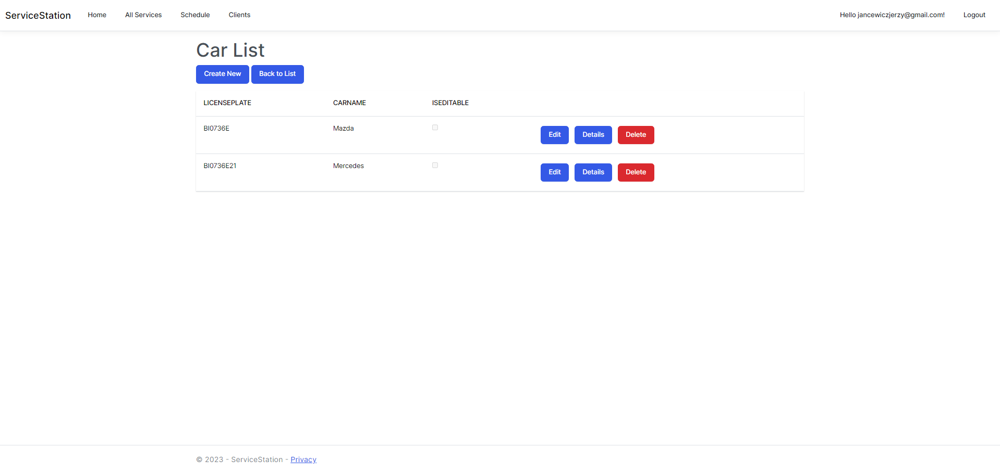

# Project Manager

## Project Overview

The application "Service Station App" provides comprehensive visibility into clients and their associated vehicles, with authentication and authorization features ensuring secure access for users. All of the data 
## Features

- **Full CRUD Operations:** Users can create, read, update, and delete projects.
- **Detailed Views:** Show detailed views of individual user and related cars.
- **Data Validation:** Client-side and server-side data validation.
- **User Registration and Login:** Enable user registration and login functionality.
- **Authentication and Authorization:** Implement user authentication and authorization using JWT Token.
- **Display related cars** Allow user to see all clients and for each client, all related cars.
  
## Application Views
### Main Page

### Client List

### Edit Panel

## Technologies
## Languages
- C# .NET
- Razor Syntax
### MVC
- CQRS 
- Entity Framework Core
### DB-Engine:
- MsSQL
